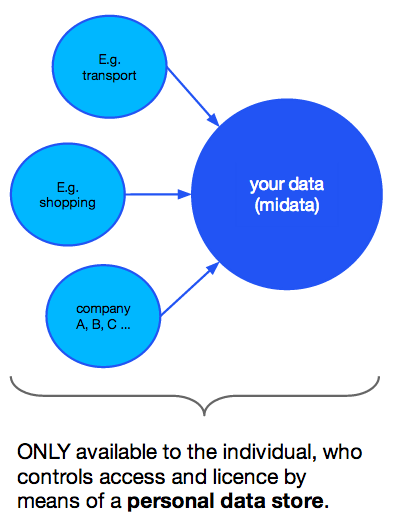
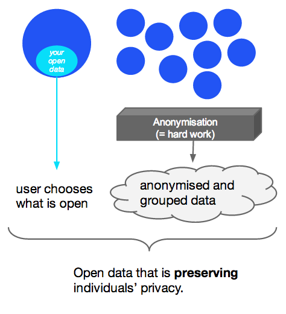

A Colloquial Definition of Big, Open, and Personal Data
-----------

### This is a DRAFT version.

### [Here is more on personal data meets open data](https://github.com/theodi/data-definitions#open-personal).

*Open data gets conflated with personal data; everyone talks about big data; yet no-one is sure what it is; we're all concerned about personal data; …* 

Here are a three **distinct** concepts of data:

1. Big Data
2. Open Data
3. Personal Data

The emphasis lies on 'distinct'. Open data can be big, but doesn't have to be. Big data is often based on personal data, but not necessarily.  
 
The following definitions are *colloquial*. They trade off accuracy with ease of understanding. For people who feel uneasy about that, I have attached a more formal definition. 

I do not claim that these definitions are exhaustive. 

The formal definitions are **not** legal advise. Always understand the context. 

### 1. *Big Data* is (i) data that you cannot handle with conventional tools *and/or* (ii) the idea that large, granular amounts of data create value almost automagically.  

**More formal**

There is no formal definition of Big Data – though many have tried.

### 2. *Open Data* is data that anyone can use; without legal, technical or financial barriers.

**More formal**

The [Open Knowledge Foundation](http://opendefinition.org/) writes: 

>A piece of data or content is open if anyone is free to use, reuse, and redistribute it — subject only, at most, to the requirement to attribute and/or share-alike.

### 3. *Personal Data* is data derived from people, where you can distinguish a person from other people in the group.

**More formal**

A technical definition of *personally identifiable information* (PII) from the [ISO 29100](http://www.iso.org/iso/home/store/catalogue_tc/catalogue_detail.htm?csnumber=45123) standard (privacy framework).
> any information that (a) can be used to identify the PII principal to whom such information relates, or (b) is or might be directly or indirectly linked to a PII principal. 

NB: To determine the risk of re-identification you have to consider all means which can reasonably be used by anyone (including the data holder) to identify the individual. 
 

### Big and Open
We can think of it in two ways:

1. Big Data that is made available as Open Data (see our Big Data Publishing guide) or
2. Open Data that combined with other information achieve Big Data status.

Governments around the world are excited about this because they see its potential for transparency and economic growth. However, at the moment most of it is just data, not information, and even more of it is not open.

### Big and Personal 

This is the intersection where big business gets excited. Enhanced selling, geo-targeted advertising, personalised recommendations all derive from algorithms mining customer (= people) data. The few examples where individuals benefit from Big Data do not balance this asymmetry. The public are passive when it comes to Big Data. With more algorithm shaping our lives than ever before (take credit scoring for example), combining Big and Personal Data will continue to create tensions.

### [Open and Personal](id:open-personal)
Personal Data is not Open Data without *explicit* and *informed* consent from the individual. There are only a few exceptions such as the Law requiring you to publish Personal Data or an individual opening up her own data.

However, Personal Data **can** be published if it is sufficiently anonymised because then it is no longer Personal Data. 'Sufficiently' is of course a subjective term, but modern techniques have proven to be very effective at minimising the risk of anonymised data.

#### Personal data is

**"closed data" if it is**

* user data give back to the user (e.g. UK midata, US greenbutton) 
* user data mashed up with other closed data to provide new services
* user data mashed up with other open data to provide new services
* aggregate user data anonymised and used as closed data     

**"open data" if it is**

* aggregate user data anonymised and released as open data
* user data that individual user release themselves as open data

<table id="open-personal" style="border:white;">
<tbody>
<tr>
<td class="align-center"></td>
<td class="align-center"></td>
</tr>
</tbody>
</table>

### Big Open Personal (BOP) Data 

Does it exist? It would require a special type of *data nudist* to be willing to share large amounts of his/her personal life. Some have hopes in people voluntarily contributing to large open scientific dataset that have the potential to advance medicine for example. Combining your available online activities such as social media data may be getting close to a combination of all three. It is essentially a flavour with more than an acquired taste; for many not acceptable.

## Licence

Venn diagram inspired by [Drew Conway](http://www.drewconway.com)

All ISO publications are protected by copyright. 

The content of [opendefinition.org](http://opendefinition.org/) and everything else is licensed under a [Creative Commons Attribution 3.0 License](http://creativecommons.org/licenses/by/3.0/). 
